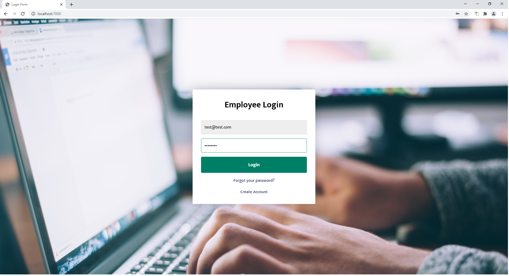

# Expense Reimbursement System

## Description
This application allows all Employees to login to their account and submit reimbursement requests for expenses incurred while on company time. Employees are also able to view their entire request history while logged in.

Managers are able to login and view all reimbursement requests for all Employees. They are also able to specify which Employee reimbursement history to view. Managers are authorized to approve or deny any expense reimbursement request.

## Technologies Used
- Java 1.8
- JavaScript
- HTML
- CSS 
- JDBC 
- PostgreSQL 42.2.24
- Javalin 4.1.1
- Maven 4.0
- JUnit4 5.6.2
- Log4J 1.7.32

## Features
- Login, Logout
- View Reimbursement request history
- Submit new Reimbursement Request
- Approve or Deny Reimbursement request

### To-do List
- New account registration feature
- Reset password feature
- Ability to upload a file with each reimbursement request

## Getting Started
1. Fork the repository: https://github.com/delujan/revature-project1.git
2. Navigate to desired folder location on local machine
3. Run Git Bash from this location
4. Clone the forked repository: git clone yourForkedRepositoryName
5. Open Eclipse IDE (preferred) and import project
6. Start the application and navigate to localhost:7000 on desired web browser
7. Login with the following credentials:  
Employee Login:  email = test@test.com | password = test1234  
Manager Login:  email = test2@test.com | password = password
## Usage
Run the application from main:

Login as either Employee or Manager:

  
  

Employee Home Page:

Submit New Reimbursement request:

Manager Home Page:

View Reimbursement Request History:

View Statistics Page:

